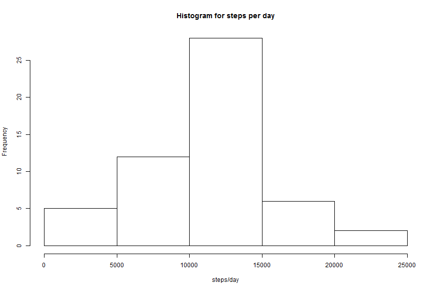
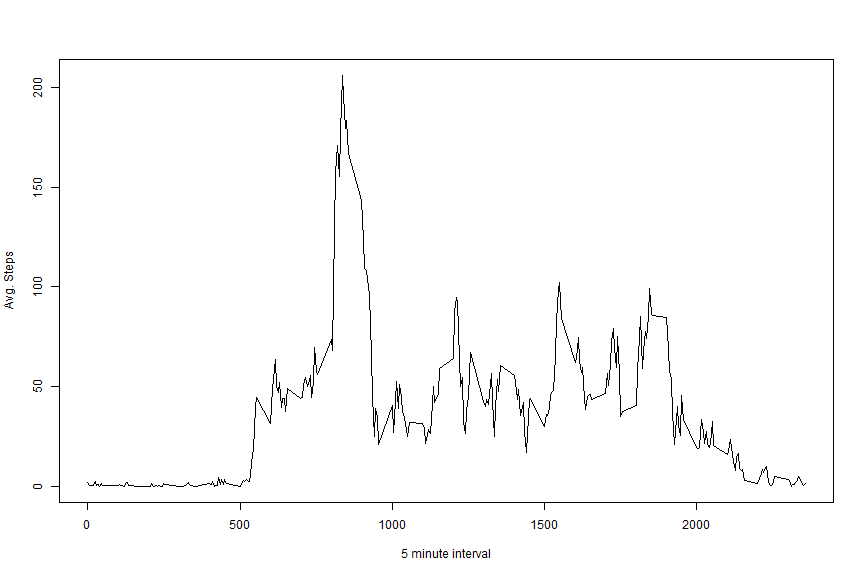
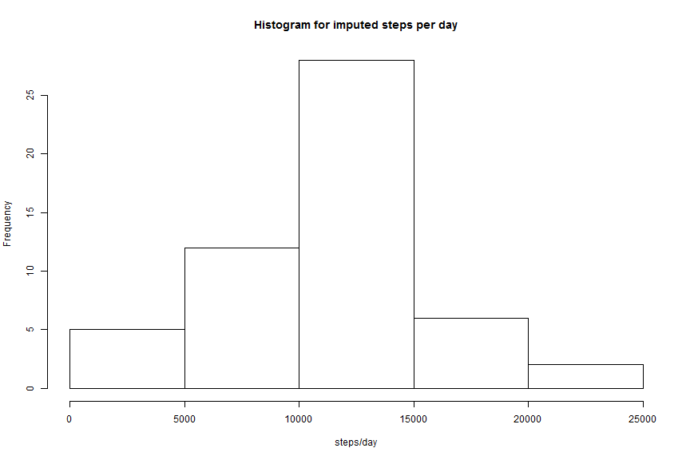
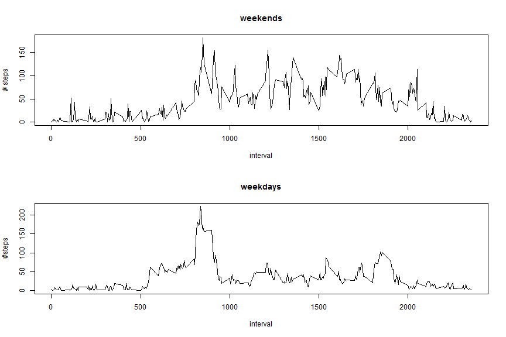

<br/><br/>

## Loading and preprocessing the data

```r
#location of dataset that will be used
uri <- "https://d396qusza40orc.cloudfront.net/repdata%2Fdata%2Factivity.zip"
```

*If you would like to execute this in local environment, you may use the following to create directory if not exists and download data*

```r
if(!file.exists("data")){dir.create("data")}
download.file(uri,destfile="data/activityMonitoringData.zip")
```


```r
#extract and load data
activityData <- read.csv(unz("data/activityMonitoringData.zip","activity.csv"))
```
<br/><br/>

## What is mean total number of steps taken per day?

```r
stepsDay <- aggregate(. ~ date, data=activityData, FUN=sum)
stepsDay <- stepsDay[c(1,2)]
#histogram of steps/day
hist(stepsDay$steps, main="Histogram for steps per day", xlab="steps/day")
```

 

```r
mean(stepsDay$steps)
```

```
## [1] 10766.19
```

```r
median(stepsDay$steps)
```

```
## [1] 10765
```
<br/><br/>

## What is the average daily activity pattern?

```r
#load plyr package
library(plyr)
#Average steps/interval
stepsInterval <- ddply(activityData, "interval", summarize, Avg=mean(steps,na.rm=TRUE))

#plot avg steps/interval
plot(stepsInterval, type="l", xlab="5 minute interval", ylab="Avg. Steps")
```

 

```r
#max steps 5 minute interval
max(stepsInterval$Avg)
```

```
## [1] 206.1698
```

```r
#interval with max steps
stepsInterval[stepsInterval$Avg==max(stepsInterval$Avg),1]
```

```
## [1] 835
```
<br/><br/>

## Imputing missing values

```r
#count of missing values for steps
sum(is.na(activityData$steps))
```

```
## [1] 2304
```

```r
#fill in NA values with interval avg
activityData.withIntervalMeans <- merge(activityData,stepsInterval, by="interval")
activityData.withIntervalMeans$imputedSteps <- activityData.withIntervalMeans$steps
naData <- is.na(activityData.withIntervalMeans$imputedSteps)
activityData.withIntervalMeans$imputedSteps[naData] <- activityData.withIntervalMeans$Avg[naData]
activityData.naData <- is.na(activityData$steps)
activityData$steps[activityData.naData] <- activityData.withIntervalMeans$imputedSteps[activityData.naData]

#differences in hist, mean, median
#histogram of steps/day
hist(stepsDay$steps, main="Histogram for steps per day", xlab="steps/day")
```

 

```r
#histogram imputed steps/dat
stepsImputedDay <- aggregate(. ~ date, data=activityData.withIntervalMeans, FUN=sum)
stepsImputedDay <- stepsImputedDay[c(1,5)]
hist(stepsImputedDay$imputedSteps, main="Histogram for imputed steps per day", xlab="steps/day")
```

 

```r
#Mean & Median per day
stepsImputedDay.aggregate = ddply(stepsImputedDay, .(date), summarize,  Mean=mean(imputedSteps), Median=median(imputedSteps))
##Previously
mean(stepsDay$steps)
```

```
## [1] 10766.19
```

```r
median(stepsDay$steps)
```

```
## [1] 10765
```

```r
##Imputed
mean(stepsImputedDay$imputedSteps)
```

```
## [1] 10766.19
```

```r
median(stepsImputedDay$imputedSteps)
```

```
## [1] 10765
```
###Conclusion: imputing missing values does not measurably impact data
<br/><br/>

## Are there differences in activity patterns between weekdays and weekends?

```r
activityData$dayOfWeek <- weekdays(as.Date(activityData$date))
activityData$dayNumberOfWeek <- as.POSIXlt(activityData$date)$wday
week.dayNumber <-c(1,2,3,4,5)
#factor weekend/weekday
activityData$typeOfDay <- factor(activityData$dayNumberOfWeek %in% week.dayNumber
                                 ,levels=c(FALSE, TRUE), labels=c('weekend', 'weekday'))
#datasets for weekend/weekday
activityData.weekdays <- activityData[activityData$typeOfDay=="weekday",]
activityData.weekends <- activityData[activityData$typeOfDay=="weekend",]

#average for intervals
activityData.weekends.intervalAverage <- ddply(activityData.weekends, "interval",summarize, Avg = mean(steps))
activityData.weekdays.intervalAverage <- ddply(activityData.weekdays,"interval", summarize, Avg = mean(steps))

#plot
par(mfrow=c(2,1))
#plot weekend/weekday interval aaverages
with(activityData.weekends.intervalAverage,plot(interval,Avg, type="l",main="weekends", ylab="# steps"))
with(activityData.weekdays.intervalAverage,plot(interval,Avg, type="l", main="weekdays", ylab="#steps"))
```

 


###Conclusion: There is a difference in step activity between weekends and weekdays.  While there is a larger initial single spike for weekdays, weekends show an increase in step activity across waking time intervals.
